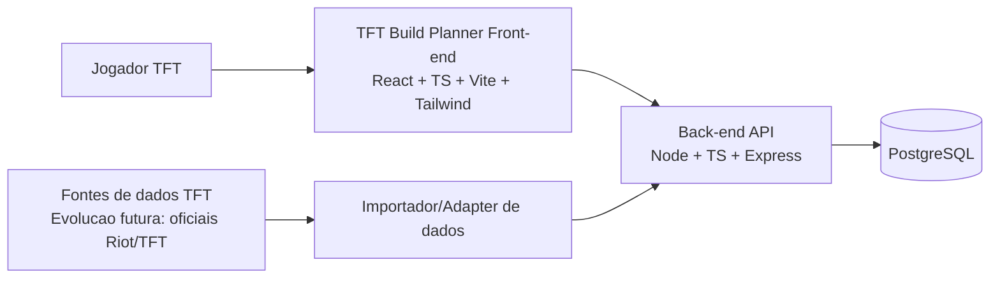
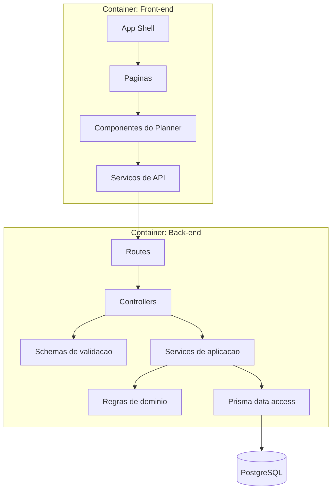
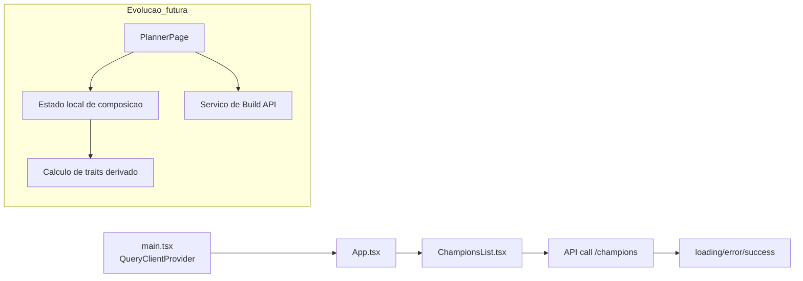
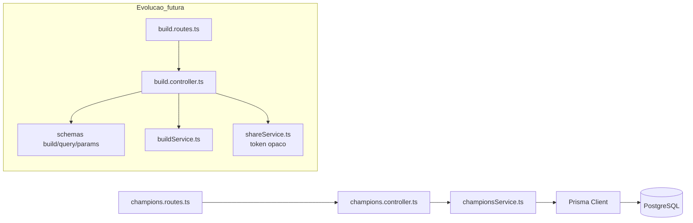

# Arquitetura

## Motivacao arquitetural

A arquitetura foi desenhada para equilibrar:

- simplicidade para aprender;
- separacao de responsabilidades;
- capacidade de evoluir sem refatoracao destrutiva.

O projeto esta em fase inicial e ja possui API de campeoes + lista no front. A proposta abaixo consolida esse caminho para suportar Build, Trait ativa e compartilhamento por token opaco no MVP.

## Principios adotados

- Separar dominio, interface e infraestrutura.
- Priorizar contratos claros e tipados entre camadas.
- Manter componentes pequenos e responsabilidades explicitas.
- Nao antecipar complexidade sem necessidade (evitar overengineering).
- Preparar ponto de extensao para integracoes externas por adapters.

## Visao geral da solucao

- Front-end React consome API HTTP do back-end.
- Back-end Node + Express expoe endpoints REST.
- Prisma encapsula acesso ao PostgreSQL.
- Dados externos do ecossistema TFT entram por scripts/adapters, sem contaminar o dominio interno.

## C4 - Diagrama de contexto

## C4 - Diagrama de containers

## C4 - Componentes do front-end

## C4 - Componentes do back-end

## Responsabilidades por camada

### Interface (front-end)

- Renderizar dados e interacoes.
- Manter estado de tela e estado de composicao temporaria.
- Exibir resultado de regras ja calculadas ou calcular derivacoes de exibicao simples.

### Aplicacao (back-end)

- Orquestrar casos de uso.
- Validar entrada e montar respostas HTTP consistentes.
- Chamar regras de dominio e repositorios.

### Dominio

- Regras de composicao.
- Calculo de traits ativas e thresholds.
- Regras de compartilhamento e consistencia de Build.

### Infraestrutura

- Prisma/PostgreSQL.
- HTTP, CORS, Docker, variaveis de ambiente.
- Importacao e adaptacao de dados externos.

## Fluxo principal de dados

Estado atual:

1. Front chama GET /champions.
2. Router direciona para controller.
3. Controller aplica regra de query (name, skip, take) e chama service.
4. Service consulta Prisma.
5. Resposta JSON retorna para o front.

Fluxo alvo do MVP completo:

1. Usuario monta composicao no board.
2. Front envia payload de Build para API.
3. Back valida, persiste Build/BuildSlot e retorna id/token de compartilhamento.
4. Link compartilhado resolve build por token opaco.

## Decisoes de modularizacao

- Front:
  - componentes de apresentacao separados de servicos HTTP.
  - evolucao para camada de mapeamento DTO -> tipos internos.

- Back:
  - routes e controllers separados de services.
  - validacao dedicada antes da regra de negocio.
  - repositorio/acesso via Prisma desacoplado da interface HTTP.

## Pontos de atencao para crescimento

- Evitar vazar rawJson do banco para a UI sem filtro.
- Introduzir DTOs explicitos para Build antes de abrir endpoint publico.
- Limitar paginação e validar query para evitar abuso.
- Introduzir tratamento centralizado de erros conforme API crescer.

## Boa para aprender vs melhor para producao

### Boa para aprender (agora)

- Arquitetura modular simples com poucas camadas.
- Uso direto de service + Prisma, sem excesso de abstracao.
- Foco em fechar fluxo ponta a ponta do MVP.

### Melhor para producao (depois)

- Observabilidade (logs estruturados, tracing).
- Rate limiting e hardening de seguranca.
- Cache para catalogos e endpoints de consulta.
- Testes automatizados mais amplos e CI/CD com quality gates.
